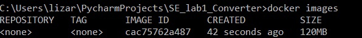
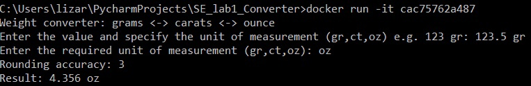

# Лабораторная работа №1
[](https://github.com/LizaZaytseva/SE_lab1_converter/actions/workflows/main.yml)
В ходе данной лабораторной работы был реализован конвертор, позволяющий переводить
значения в 3 единицы измерения: граммы, унции и караты.
Также пользователь может регулировать точность округления значения.\
Рассмотрим пример запуска программы: \
```Weight converter: grams <-> carats <-> ounce``` \
```Enter the value and specify the unit of measurement (gr,ct,oz) e.g. 123 gr: 1 oz```\
```Enter the required unit of measurement (gr,ct,oz): ct```\
```Rounding accuracy: 3```\
```Result: 141.748 ct```\
Пример запуска в докер-контейнере:\
 \
 
